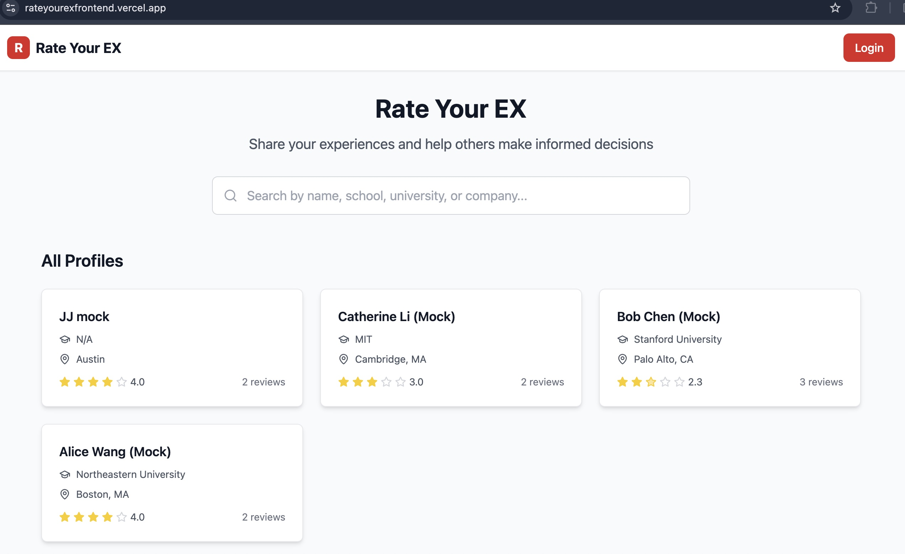
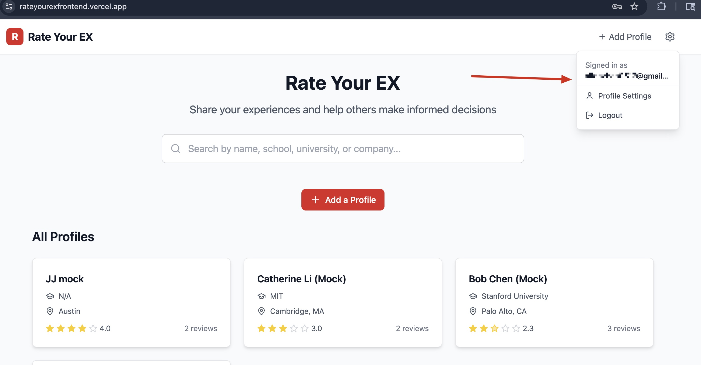
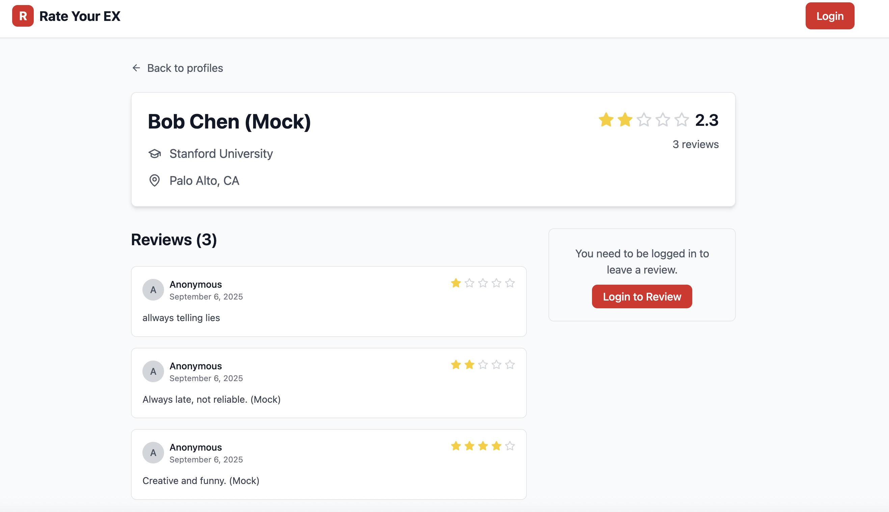
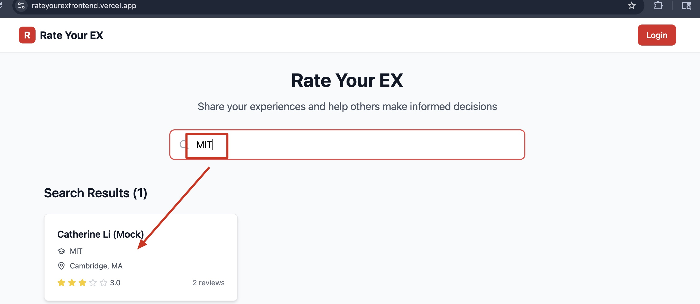
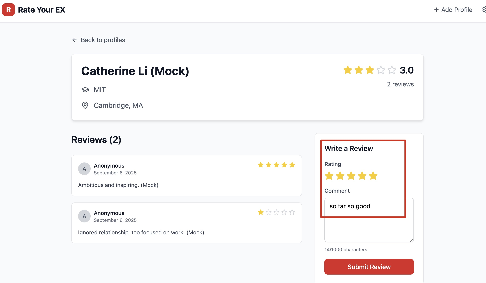

# Rate Your EX

A full-stack web application for anonymously rating and reviewing profiles. Built with React, Express, and Supabase.
# 🚀 Live Demo  
👉 [Click here to try Rate Your EX](https://rateyourexfrontend.vercel.app/)

## Features

- 🔐 **User Authentication** - Register, login, logout using Supabase Auth
- 👤 **Profile Management** - Create and view profiles with name, school/university/company, and location
- ⭐ **Anonymous Reviews** - Rate profiles (1-5 stars) with comments
- 🔍 **Search Functionality** - Search profiles by name, school, university, or company
- 📱 **Responsive Design** - Mobile-friendly interface with TailwindCSS
- 🛡️ **Privacy Focused** - All reviews are completely anonymous

## Tech Stack

### Frontend
- **React 18** - UI framework
- **Vite** - Build tool and dev server
- **TailwindCSS** - Styling
- **React Router** - Client-side routing
- **Lucide React** - Icons

### Backend
- **Node.js** - Runtime environment
- **Express** - Web framework
- **Supabase** - Database and authentication
- **PostgreSQL** - Database (via Supabase)

## Project Structure

```
rate-your-ex/
├── backend/                 # Express API server
│   ├── routes/             # API route handlers
│   ├── middleware/         # Express middleware
│   ├── utils/              # Utility functions
│   ├── database/           # Database schema and migrations
│   ├── package.json
│   └── server.js
├── frontend/               # React application
│   ├── src/
│   │   ├── components/     # Reusable UI components
│   │   ├── pages/          # Page components
│   │   ├── contexts/       # React contexts
│   │   ├── hooks/          # Custom React hooks
│   │   ├── utils/          # Utility functions
│   │   └── App.jsx
│   ├── package.json
│   └── vite.config.js
├── package.json            # Root package.json
└── README.md
```

## Prerequisites

- Node.js (v16 or higher)
- npm or yarn
- Supabase account

## Setup Instructions

### 1. Clone and Install Dependencies

```bash
# Install root dependencies
npm install

# Install all project dependencies
npm run install:all
```

### 2. Set up Supabase

1. Create a new project at [supabase.com](https://supabase.com)
2. Go to Settings > API to get your project URL and keys
3. Go to SQL Editor and run the schema from `backend/database/schema.sql`

### 3. Environment Configuration

#### Backend Environment
Create `backend/.env` file:
```bash
cp backend/env.example backend/.env
```

Edit `backend/.env` with your Supabase credentials:
```env
SUPABASE_URL=your_supabase_project_url
SUPABASE_ANON_KEY=your_supabase_anon_key
SUPABASE_SERVICE_ROLE_KEY=your_supabase_service_role_key
PORT=3001
NODE_ENV=development
FRONTEND_URL=http://localhost:5173
```

#### Frontend Environment
Create `frontend/.env` file:
```bash
cp frontend/env.example frontend/.env
```

Edit `frontend/.env` with your Supabase credentials:
```env
VITE_SUPABASE_URL=your_supabase_project_url
VITE_SUPABASE_ANON_KEY=your_supabase_anon_key
VITE_API_BASE_URL=http://localhost:3001/api
```

### 4. Database Setup

1. In your Supabase dashboard, go to SQL Editor
2. Run the contents of `backend/database/schema.sql` to create tables and policies
3. Optionally run `backend/database/seed.sql` to add sample data

### 5. Running the Application

#### Development Mode (Both Frontend and Backend)
```bash
npm run dev
```

This will start:
- Backend server on http://localhost:3001
- Frontend dev server on http://localhost:5173

#### Individual Services

**Backend only:**
```bash
npm run dev:backend
```

**Frontend only:**
```bash
npm run dev:frontend
```

**Production:**
```bash
# Build frontend
npm run build

# Start backend
npm start
```

## API Endpoints

### Authentication
- `POST /api/auth/register` - Register new user
- `POST /api/auth/login` - Login user
- `POST /api/auth/logout` - Logout user
- `GET /api/auth/me` - Get current user

### Profiles
- `GET /api/profiles` - List profiles (with optional search)
- `GET /api/profiles/:id` - Get profile with reviews
- `POST /api/profiles` - Create new profile (requires auth)

### Reviews
- `GET /api/profiles/:id/reviews` - Get reviews for a profile
- `POST /api/profiles/:id/reviews` - Add review to profile (requires auth)

## Database Schema

### Tables

**profiles**
- `id` (UUID, Primary Key)
- `name` (VARCHAR)
- `school` (VARCHAR) - Can be school, university, or company name
- `location` (VARCHAR)
- `created_by` (UUID, Foreign Key to auth.users)
- `created_at` (TIMESTAMP)
- `updated_at` (TIMESTAMP)

**reviews**
- `id` (UUID, Primary Key)
- `profile_id` (UUID, Foreign Key to profiles)
- `rating` (INTEGER, 1-5)
- `comment` (TEXT)
- `created_by` (UUID, Foreign Key to auth.users)
- `created_at` (TIMESTAMP)
- `updated_at` (TIMESTAMP)

### Row Level Security (RLS)
- Profiles are publicly readable
- Only authenticated users can create profiles
- Users can only update/delete their own profiles
- Reviews are publicly readable (anonymous)
- Only authenticated users can create reviews
- Users can only update/delete their own reviews

## Features Overview

### Home Page
- Search bar for finding profiles by name or school
- Grid of profile cards showing name, school, location, and average rating
- Call-to-action for adding new profiles

### Profile Detail Page
- Profile information (name, school, location)
- Average rating and review count
- List of all reviews (anonymous)
- Review form for authenticated users

### Authentication
- Email/password registration and login
- Protected routes for profile creation and review submission
- Automatic token management

### Review System
- 5-star rating system
- Text comments (up to 1000 characters)
- Completely anonymous (no reviewer identity shown)
- One review per user per profile

## Development

### Adding New Features
1. Backend: Add routes in `backend/routes/`
2. Frontend: Add components in `frontend/src/components/`
3. Update API client in `frontend/src/utils/api.js`

### Styling
- Uses TailwindCSS utility classes
- Custom components defined in `frontend/src/index.css`
- Responsive design with mobile-first approach

### State Management
- React Context for authentication state
- Local state for component-specific data
- API calls handled through utility functions

## Deployment

### Frontend (Vercel/Netlify)
1. Build the frontend: `npm run build`
2. Deploy the `frontend/dist` folder
3. Set environment variables in your hosting platform

### Backend (Railway/Heroku)
1. Deploy the `backend` folder
2. Set environment variables
3. Ensure database connection is configured

### Database
- Supabase handles the database hosting
- No additional setup required

## Contributing

1. Fork the repository
2. Create a feature branch
3. Make your changes
4. Test thoroughly
5. Submit a pull request

## License

MIT License - see LICENSE file for details

## Support

For issues and questions:
1. Check the existing issues
2. Create a new issue with detailed description
3. Include steps to reproduce any bugs

---

**Note**: This application is for educational purposes. Please ensure you comply with all applicable laws and regulations regarding data privacy and user consent in your jurisdiction.

<h2>🏠 Homepage</h2>


<h2>🔑 Login Function</h2>


<h2>📝 Review Detail</h2>


<h2>🔎 Search Function</h2>


<h2>✍️ Write a Review</h2>

